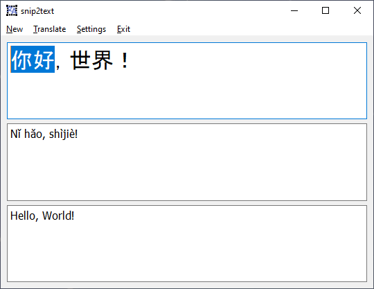

# snip2text
Python app that allows to snip a region of a screen and automatically recognize text and translate it.

# Description
A user can grab a screen region like in any other snipping apps.<br>
But instead of showing a picture, it recognizes Chinese and English text, and outputs it to textbox with Pinyin and English translation aside.<br>
The quality of OCR is relatively OK. It's engined by [CnOCR](https://github.com/breezedeus/CnOCR) and densenet_lite_136-gru, db_resnet34 models.
Offline translation is engined by [Argos Translate](https://github.com/argosopentech/argos-translate) and the quality is worse comparing to Google Translate for Chinese. But it's enough for a user to take a sense of it anyway. 



## It works on my machine
I tested it and now use it on one machine which is:
- Windows 10 operating system
- PyTorch 2.1.1
- Python 3.11 64-bit (by the time of development PyTorch didn't support Python 3.12)
- Cuda 12.1 - not relevant if you switch to OCR CPU models or if you have AMD GPU (see CnOCR documentation)
- NVIDIA GeForce RTX 2060 GPU - not relevant if you use CPU OCR.

### Windows OS and multiple monitors
It's small, OS-agnostic application. I expect it to run in all operating systems. But if you have multiple monitors configuration, maybe I miscalculate region offsets in Linux and macOS. I saw some other possibilities in ```Tkinter``` instantiation, but it's relative to X11 only.

# Installation
1. Read PyTorch manual because versions below might differ by the time of you reading this
2. Install Python 3.11
3. Install Cuda if you have NVIDIA
4. Install PyTorch
5. Clone the repo
6. Read CnOCR documentation and fix models in the [recognition.py](recognition.py#L4) file if you don't like mine
7. Sync Python project [requirements](requirements.txt)
8. Run ```main.py```

## First Run
First start could take 30 min because CnOCR and Argos download its models.

# Technical stack
1. I took [snipping-tool](https://github.com/harupy/snipping-tool) as a base for snapping UX. UI is done with QT/Tkinter .
2. [MSS](https://github.com/BoboTiG/python-mss) for screen region grabbing. Because PIL grabber doesn't work for secondary screens.
3. [CnOCR](https://github.com/breezedeus/CnOCR) for Chinese/English OCR - the core feature of the app.
4. [pinyin](https://pypi.org/project/pinyin/) to translate Chinese chars to Pinyin.
5. [Argos Translate](https://github.com/argosopentech/argos-translate) for Chinese to English offline translation.

# UX
It can recognize Chinese. And sometimes it doesn't. And English translation is not optimal, say the least. But it saves me a lot of time anyway.


